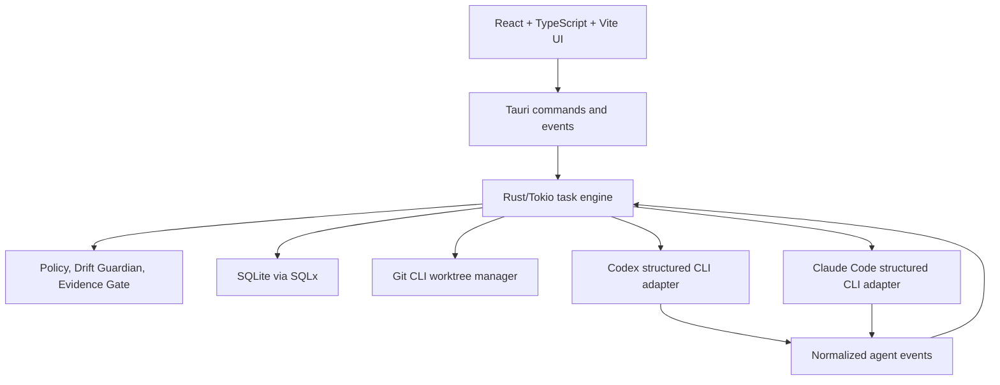

# Architecture

## System Design

Agent Sentinel is one long-running Tauri 2 desktop process in the first release. Closing the visible window does not end task supervision; the app remains in the tray or macOS menu bar.

## Responsibilities

React, TypeScript, Vite, Tailwind CSS, Radix UI or shadcn/ui, and Zustand own the prompt, project and agent selection, tray/task views, approvals, drift and evidence presentation, settings, and installation diagnostics. Rust, Tokio, Serde, SQLite, SQLx migrations, and Tracing own the task state machine, process supervision, normalization, worktrees, policy, drift, evidence, persistence, recovery, and executable discovery. The frontend never decides task state.

## Crate Boundaries

Planned crates are `sentinel-core`, `sentinel-runtime`, `sentinel-protocol`, `sentinel-storage`, `sentinel-agent-api`, `sentinel-codex`, `sentinel-claude`, `sentinel-git`, `sentinel-policy`, `sentinel-drift`, `sentinel-evidence`, `sentinel-environment`, and `sentinel-fake-agent`. Phase 2B implements `sentinel-runtime` for in-memory run orchestration, process supervision, and the internal event bus; `sentinel-core` remains the domain/storage boundary. Core crates must not depend on Tauri. The desktop app contains React features and the thin Tauri command, tray, and window layer. Foundation CI verifies this manifest boundary with `scripts/verify-core-boundaries.sh`.

## Event, Storage, And Worktree Flow

A task validates a project, records an intent contract, creates `agent-sentinel/<task-id>` and `~/.agent-sentinel/worktrees/<task-id>`, then starts an adapter with that worktree as its working directory. Structured agent events are normalized, persisted, evaluated by policy and drift rules, and emitted to the UI. Completion runs evidence and records a final outcome. The primary working directory is not modified by default; fetching happens only on user request. Tasks expose a diff summary, changed files, line counts, editor/terminal actions, patch creation, and branch name.

## Daemon And Platform Direction

## Phase 4 Codex Boundary

Phase 4 adds a private bounded `codex exec --json` runner and a persisted
`codex_run_contexts` authority record. Each context binds the internal RunId to
a backend-generated opaque reference, exact ProjectId/WorktreeId/task key,
fixed adapter/protocol identity, closed lifecycle, cancellation bit, optimistic
version, bounded progress/terminal summaries, redacted failure category, and
timestamps. Prompts, paths, argv, environment, PID, process handles, stdout,
stderr, raw JSON, and credentials are never stored in that context.

Public start/query/cancel commands require the full ownership tuple plus the
opaque reference on lookup. They return only the redacted run DTO. Lifecycle is
`created → starting → running → {succeeded|failed}` or `… → cancelling →
cancelled`; terminal states are immutable, versions prevent stale updates, and
cancellation cannot yield later success. The private active map owns only the
direct child coordination state. On restart it is deliberately not reattached:
non-terminal persisted records become a redacted `interrupted` failure. App
Server remains unavailable experimental metadata and is never launched.
Automatic worktree removal stays disabled; Phase 3 remains the authority for
exact worktree identity and inspectable diffs.

## Phase 5 Claude boundary

Phase 5 mirrors the Codex boundary for Claude stream-json: a strict UTF-8
allowlist normalizes only session, message, terminal, and permission-needed
events; fixed start/resume argv forms admit no caller flags or session token.
The private `claude_run_contexts` table binds the opaque public reference to
the same ProjectId/WorktreeId/task key and retains only a bounded private
session token, follow-up sequence, lifecycle, and redacted summaries. Public
query/follow-up/cancel DTOs never reveal the session token or process data.
Restart fails active records as interrupted and does not reconnect a session.
Phase 6 desktop workflow remains out of scope.

## Phase 6 desktop boundary

The desktop prompt is an untrusted presentation layer over explicit DTOs. It
holds opaque project/worktree IDs only, refreshes them with generation-ordered
requests, and presents run history/detail and backend-confirmed cancellation.
The tray and global shortcut only show/focus the prompt. Notification and
autostart capability are explicit unavailable states in this build; no OS
setting is silently changed. Approval decisions remain Phase 7.

`sentineld` is deferred. Extract it only when tasks must survive full app exit, a CLI or IDE client needs independent connection, multiple desktop clients need one engine, remote execution is added, or independent upgrades become necessary. The architecture stays cross-platform, but macOS is implemented and validated first. See [platform support](platform-support.md), [data model](data-model.md), and [adapter contract](agent-adapter-contract.md).
