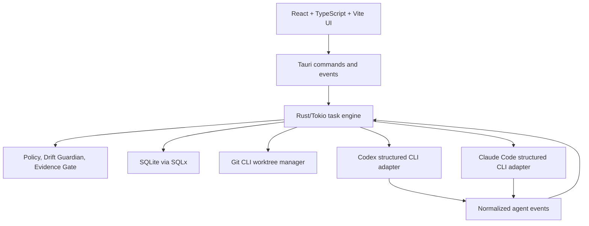

# Architecture

## System Design

Agent Sentinel is one long-running Tauri 2 desktop process in the first release. Closing the visible window does not end task supervision; the app remains in the tray or macOS menu bar.

## Responsibilities

React, TypeScript, Vite, Tailwind CSS, Radix UI or shadcn/ui, and Zustand own the prompt, project and agent selection, tray/task views, approvals, drift and evidence presentation, settings, and installation diagnostics. Rust, Tokio, Serde, SQLite, SQLx migrations, and Tracing own the task state machine, process supervision, normalization, worktrees, policy, drift, evidence, persistence, recovery, and executable discovery. The frontend never decides task state.

## Crate Boundaries

Planned crates are `sentinel-core`, `sentinel-protocol`, `sentinel-storage`, `sentinel-agent-api`, `sentinel-codex`, `sentinel-claude`, `sentinel-git`, `sentinel-policy`, `sentinel-drift`, `sentinel-evidence`, `sentinel-environment`, and `sentinel-fake-agent`. Core crates must not depend on Tauri. The desktop app contains React features and the thin Tauri command, tray, and window layer.

## Event, Storage, And Worktree Flow

A task validates a project, records an intent contract, creates `agent-sentinel/<task-id>` and `~/.agent-sentinel/worktrees/<task-id>`, then starts an adapter with that worktree as its working directory. Structured agent events are normalized, persisted, evaluated by policy and drift rules, and emitted to the UI. Completion runs evidence and records a final outcome. The primary working directory is not modified by default; fetching happens only on user request. Tasks expose a diff summary, changed files, line counts, editor/terminal actions, patch creation, and branch name.

## Daemon And Platform Direction

`sentineld` is deferred. Extract it only when tasks must survive full app exit, a CLI or IDE client needs independent connection, multiple desktop clients need one engine, remote execution is added, or independent upgrades become necessary. The architecture stays cross-platform, but macOS is implemented and validated first. See [platform support](platform-support.md), [data model](data-model.md), and [adapter contract](agent-adapter-contract.md).
