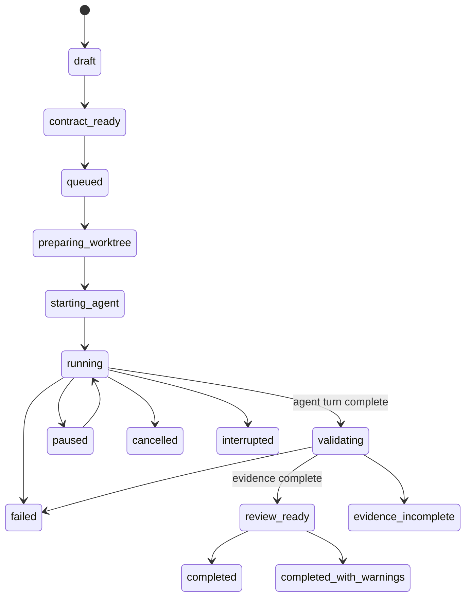

# Task State Machine

## States And Phases

Top-level states are `draft`, `contract_ready`, `queued`, `preparing_worktree`, `starting_agent`, `running`, `validating`, `review_ready`, and `completed`. Running phases are `planning`, `reading`, `editing`, `executing`, `testing`, `waiting_for_input`, `waiting_for_approval`, and `paused`. Terminal states are `completed`, `completed_with_warnings`, `evidence_incomplete`, `failed`, `cancelled`, and `interrupted`.

## Transitions And Recovery

The Rust state machine validates every transition. A task may move among running phases only while `running`; an approval blocks execution in `waiting_for_approval` until an allow or deny decision is recorded. Restart recovery inspects persisted process/session metadata, marks unknown live processes as interrupted when appropriate, preserves logs and worktrees, and permits explicitly supported resume paths.

Invalid transitions include returning a cancelled task to running, completing before validation, completing with unresolved critical drift, and treating failed required evidence as completed. Failed required evidence becomes `evidence_incomplete` or `failed` according to evaluator policy. A task is terminal only after its agent process and child processes are handled and required persistence is complete.

## Completion Guardrails

An agent’s completion message only moves the task to validation. `completed` requires required evidence to pass, no unresolved approval, no unresolved critical drift, an expected implementation diff, protected-path compliance, no orphan child process, and contract-specific checks. `completed_with_warnings` requires the same required checks with permitted optional warnings. See [evidence model](evidence-model.md).
