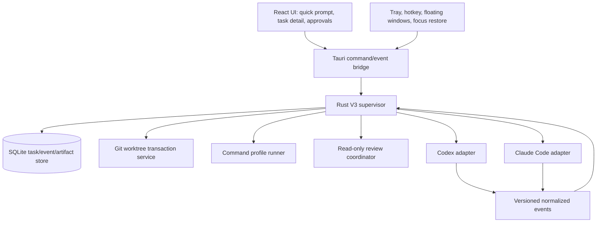

# Sentinel V3 Target Architecture

**Architecture source of truth for V3.** This document implements the product boundaries in [V3 product scope](v3-product-scope.md). [V3 workflow state machine](v3-workflow-state-machine.md) defines the authoritative V3 task transitions. Earlier V1 architecture and phase documents are historical records for the existing implementation.

## Architecture decision

Retain Tauri 2 + React/TypeScript + Rust/Tokio + SQLite. Evolve the existing Rust crates behind explicit supervisor boundaries; do not replace the desktop app with an upstream application or introduce Hermes into the core.

## Current V1 baseline versus V3 target

V1 already supplies the desktop host, tray, global shortcut, hidden floating prompt, status/settings window routes, Rust process supervision, Git worktree service, agent API, SQLite persistence, and fake-agent test infrastructure. Its real Codex/Claude paths are bounded but not released as available integrations, and its approval/evidence records do not yet drive the V3 end-to-end review-and-repair workflow. V3 retains each foundation while introducing a supervisor-owned workflow aggregate, supported provider session mapping, validation/review orchestration, and final-action approvals. Existing V1 phase contracts remain historical evidence; this document governs the target architecture for new V3 work.

## Module direction

| Existing foundation | V3 direction |
| --- | --- |
| `sentinel-core` | durable task aggregate, state-machine enforcement, migrations, audit/artifact metadata |
| `sentinel-runtime` and `sentinel-process` | supervised provider/validation processes, event fan-out, cancellation and restart reconciliation |
| `sentinel-agent-api` | versioned adapter trait, normalized event schema, capability and recovery contracts |
| `sentinel-git` | transaction-owned worktree/branch lifecycle and protected-main-tree checks |
| `sentinel-supervisor` | reusable product workflow authority composing worktree, provider, validation, review, repair, recovery, and approval boundaries |
| native SwiftUI/AppKit app | presentation-only menu-bar, window, focus, keyboard, status, and typed-intent UI through `sentinel-native-bridge` |
| desktop Tauri/React app | retained previous frontend/reference until native parity is accepted; remains non-authoritative |
| `sentinel-fake-agent` | deterministic compatibility fixtures for every adapter/workflow state |

New modules may be added only when a boundary needs isolation: `sentinel-validation`, `sentinel-review`, and `sentinel-workflow`. They depend on the core contract, never on the UI. Provider-specific Codex and Claude adapters are separate modules/crates and cannot call Git, finalize tasks, or persist arbitrary state directly. ACP, OpenCode, Gemini CLI, Hermes, and quant-development tooling may later implement optional-pack interfaces but cannot become hidden core dependencies.

## Durable records and event boundary

A task record owns immutable identity (task, project, base commit, branch, worktree), current state/version, selected workflow, approval posture, and terminal decision. Append-only events have task ID, monotonically increasing sequence, source, schema version, time, event kind, redacted payload, and causation/correlation IDs. Artifacts reference bounded/redacted logs, diffs, command results, review findings, and metrics. State changes and their decisive event are persisted atomically.

The supervisor accepts provider events only after normalization and schema validation. It calculates state from durable records; the UI replays an ordered projection and may never infer or mutate state locally.

## Agent and review boundaries

Codex uses the supported App Server or another officially supported Codex interface selected by a capability probe; a one-shot structured interface remains a declared fallback only if it supports the required lifecycle. Claude Code uses its supported CLI/session interface, including documented structured output and session resume where available. The adapter records what is actually supported and fails closed for missing start/resume/stream/cancel/recovery capability—no terminal scraping masquerades as structured integration.

Implementer sessions may edit only their managed worktree subject to Sentinel policy. Reviewer sessions are read-only: Sentinel supplies a constrained diff/context package and does not expose write tools, shell mutation, credentials, or worktree-control commands. Review output is advisory until Sentinel validates its schema and confirms evidence; deterministic command failures require repair or human disposition even if a reviewer reports success.

## Ambient macOS behavior

The tray item, global hotkey, and status widget request a floating quick-prompt/task window. The existing prompt, status, and settings surfaces are retained and progressively repurposed: Quick Prompt starts tasks, Attention Widget communicates active/attention-required state, and Task Detail presents activity, diff, checks, findings, rounds, and final actions. Before activation, native code records the frontmost eligible application; after submit, hide, Escape, or completion acknowledgement, it restores focus only if the user has not intentionally changed focus. The app is configured as an accessory/menu-bar experience where supported, while retaining an explicit accessible task-detail window. Native behavior is capability-checked and tested separately from UI state.

## Security and recovery rules

Sentinel creates and cleans only worktrees it owns and has recorded. No automatic commit, merge, push, discard, rollback, or destructive cleanup occurs; each needs an explicit human approval bearing the current task/version and clear effect. Restart reconciliation validates durable ownership and known direct children; uncertain active work becomes recoverable/interrupted, retains its worktree, and exposes a safe resume or inspect action. Credentials, raw provider transcripts, arbitrary environment values, and secret-looking data are redacted/capped before durable storage or UI exposure.
